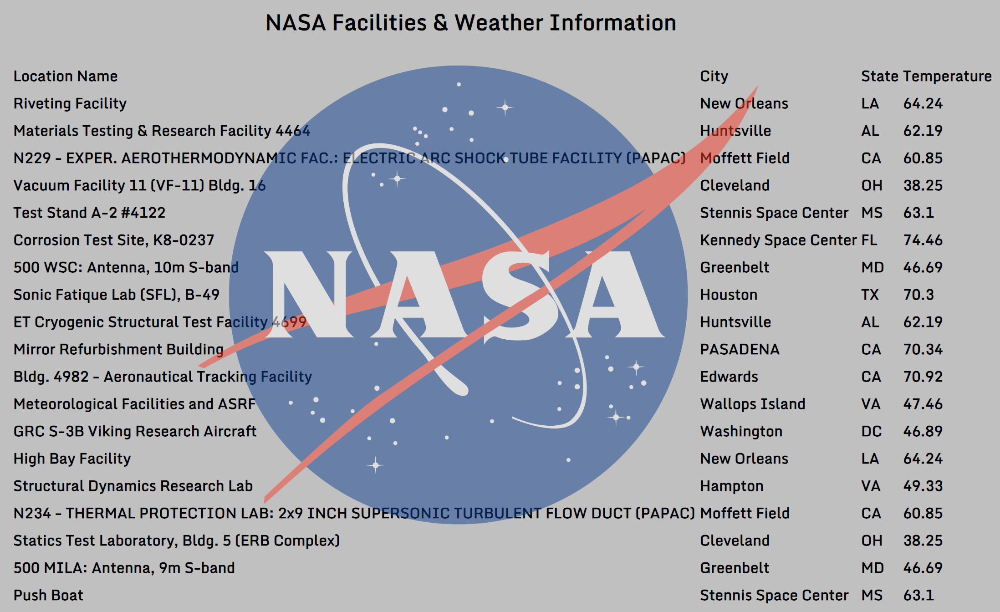

# NASA Facilities and Weather
See a list of NASA facilities and weather in that area.

**Link to project:** https://friendly-cray-8641d2.netlify.com/

## How It's Made:

**Tech used:** HTML5, CSS3, JavaScript, NASA and OpenWeather APIs.

This project was written in JavaScript using the fetch method to access the NASA API. This fetch returns a list of the NASA facilities which is then passed through the Weather API. The Weather uses the location data to return the temperature. This project was designed using CSS3.

## Lessons Learned:

This project furthered my understanding of complex API structures.

## Related Projects:
Take a look at these projects that I have in my portfolio:

**NASA Photo API:** https://gallant-pasteur-e1c256.netlify.com/

**New Recipe & Fact:** https://friendly-snyder-f7f591.netlify.com/

**Pokemon API:** https://admiring-cray-e04cdb.netlify.com/
